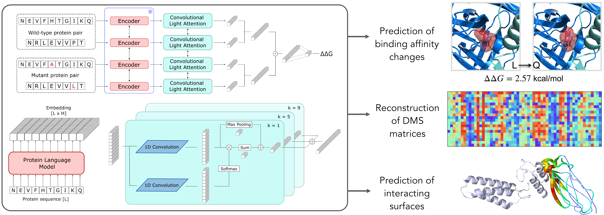

# MuLAN — PLM + FoldX binding ΔΔG under leakage-controlled evaluation

A research fork of [**MuLAN**](https://github.com/GianLMB/mulan) (Lombardi & Carbone), which predicts
the effect of mutations on protein–protein binding affinity (ΔΔG) from **sequence alone**, via
transfer learning from protein language models into a light-attention head.



<sub>Visual abstract by Lombardi & Carbone, redistributed verbatim from the upstream MuLAN
repository under its CC BY-NC-SA 4.0 licence — see [NOTICE](NOTICE). The same figure appears in
their bioRxiv preprint, which carries CC BY-NC; the grant relied on here is the repository's.</sub>

## What this fork asks

Sequence-only ΔΔG predictors look strong under the evaluation protocol they are usually reported
with — random cross-validation over mutations, where the same complex sits in train and test — and
much weaker under the one the field has moved to, which holds out whole complexes, sequence
families or CATH superfamilies and scores each structure on its own. This fork takes that
seriously and asks what, if anything, closes the gap:

1. **Does the choice of language model matter?** Ten backbones spanning 600M to 16B parameters —
   ESM-2, Ankh v1 and v3, ProstT5, SaProt 650M and 1.3B, ESM-C 600M and 6B, AIDO — under one
   training recipe. ESM3 and MINT were run on the S1102 retrain tiers only — S1102 is upstream
   MuLAN's curated 1,102-mutation subset of SKEMPI — and not on full SKEMPI. Their folds are
   under `results/retrain_{bycomplex,clustered}/`; MINT is written up in
   `experiments/retrain_split/SUMMARY.md` and in `experiments/BENCHMARK_MATRIX.md`, ESM3 has no
   prose write-up beyond its folds.
2. **Does cheap biophysics substitute for structure?** A **FoldX binding-ΔΔG score channel** —
   FoldX is an empirical force field that estimates a mutation's binding ΔΔG from the complex's
   structure, and the *channel* feeds that estimate to the model's head as one extra input per
   mutation — computed once and reused across every backbone, in a 1-parameter and a
   226-parameter variant.
3. **What survives leakage-controlled evaluation?** By-complex (the held-out unit is the
   interface, so no training mutation comes from a test interface), sequence-clustered (no
   training complex shares a sequence family, clustered at ≤60% identity, with a test complex)
   and **CATH-superfamily** (no shared structural superfamily) hold-outs, scored per
   structure — the protocol the published frontier uses, so the results drop into its tables
   directly. "The published frontier" means the leakage-controlled ΔΔG methods in the table
   below, all reported on USP-ddG's CATH split.

**The finding, in one sentence:** base language models collapse out-of-family regardless of scale,
and a cheap encoder-independent FoldX channel recovers most of the loss — putting a *frozen*
sequence model within reach of methods that consume structure directly.

### Where that lands on the CATH hold-out

687 mutations over 50 complexes, of which 13 carry the ≥10 mutations needed to be scored.
Per-structure Spearman at T ≥ 10, against the published frontier — the mean over complexes of
the within-complex Spearman, over complexes carrying at least 10 mutations. Written both `ps-Sp` and `ppS`
throughout this repository; they are one quantity.

| # | method | CATH ps-Sp | |
|--:|---|--:|---|
| 1 | CATH-ddG | 0.494 | published |
| 2 | USP-ddG | 0.493 | published |
| 3 | flex-ddG | 0.454 | published |
| 4 | **MuLAN + FoldX** (ESM-C 6B, scalar) | **0.438** | here |
| 5 | FoldX | 0.430 | published |
| 6 | BA-DDG | 0.402 | published |
| 7 | **FoldX alone** | **0.383**† | here |
| 8 | Prompt-DDG | 0.303 | published |
| 9 | RDE-Network | 0.288 | published |
| 10 | DiffAffinity | 0.249 | published |
| 11 | PPIformer | 0.216 | published |

Fourth of eleven. † Row 7 is the one number here that cannot be recomputed from what ships: it
needs the mapping files of the multi-point chain remap — the step that translates the split's
synthetic A/B, contiguous-position mutation labels into the raw SKEMPI chain-and-residue keys
the FoldX store is indexed by — which are not redistributable, and
[`docs/REPRODUCE.md`](docs/REPRODUCE.md) says so before you try. Row 4 is fully reproducible — the
recipe in
[`data/splits/splits_skempi_full_cath_kfold/README.md`](data/splits/splits_skempi_full_cath_kfold/README.md)
rebuilds the split and lands on it.

The published rows are all `USP-ddG Table 1`, transcribed in
[`data/benchmarks/frontier.tsv`](data/benchmarks/frontier.tsv) with their source per row.

**Rows 5 and 7 are both FoldX, and the gap between them is the caveat that governs how to read
this table.** The lift over the FoldX measured *here* is **+0.055 [+0.001, +0.118]** — most of the
0.438 arrives free. But the published FoldX row is 0.430, not 0.383, so against *that* baseline the
margin is a rounding error. Our store ships at a single `RepairPDB` pass (FoldX's structure-repair
step, run before any energy is computed), the FoldX default, and
that is the likely cause: five repairs move our CATH-single FoldX from 0.398 to 0.459, past the
published row — the energies behind both repair counts ship at
[`data/foldx_repair_ablation/`](data/foldx_repair_ablation/), so that claim is checkable rather
than asserted. Read this as a strong physics baseline that a frozen sequence model reaches, not
clears — [`OPEN_QUESTIONS.md`](OPEN_QUESTIONS.md) has the measurement and the caveats, including
that the two FoldX rows are not computed on identical row sets (687 here against their 813).

**That row-set mismatch applies to row 4 as well, not just to the two FoldX rows.** Every
published row is USP-ddG's 813 mutations over 53 complexes; ours is 687 over 50, and the
per-structure mean averages the **13** that carry ≥10 mutations. How many complexes their mean
averages is not stated in the source and cannot be recovered here. And the interval on 0.438 is
[0.327, 0.551] — **CATH-ddG at 0.494 and USP-ddG at 0.493 both fall inside it**. The ordering above
is a ranking of point estimates whose intervals overlap the top of the table; treat it as "reaches
the frontier", which is what [`docs/RESULTS.md`](docs/RESULTS.md) §26 concludes, and not as a rank.

CATH is the rung — a tier, read as one step of a ladder of increasing strictness — this comparison
rests on, because it is the one where the two FoldX baselines are verified to agree on the metric
the protocol was introduced with: **AUROC 0.760 here against the 0.754 published for FoldX in the
same table**, at 100% channel coverage (every scored row carries a computed FoldX value) on both
sides. That
agreement is what the ranking above rests on, and it does not extend to the Spearman column. The
by-complex and clustered rungs differ in baseline by 0.06 and 0.22, so they are reference tiers
(a *tier* is one evaluation protocol applied to one dataset — see the glossary)
rather than headlines, and the clustered figure is not quotable as a win at all. Thirteen scored
complexes is also too few to rank backbones on — what the tier supports is the comparison above,
not an ordering within it.

[`docs/RESULTS.md`](docs/RESULTS.md) is the source of truth for every number here — §25 for the
per-backbone CATH table, §26 for the leaderboard and for the baseline agreement it rests on.

Two results that are already settled and are worth stating because they are negative:

- **Scale does not buy generalization.** Bigger backbones do not rescue out-of-family performance;
  per-step training cost tracks embedding *width*, not parameter count, so the largest models are
  not even reliably the slowest.
- **Interface localization is Ankh-specific.** The upstream attention→interface result reproduces
  exactly, but no other backbone matches it, and scaling *hurts*. See
  `experiments/attention_interface/`.

## Repository map

```
mulan/            core library — light-attention model, dataset/collator, trainer, PLM loading
scripts/          the five CLIs (train · predict · att · landscape · plm-embed), plus
                  audit_local_results.py — an integrity check over a tree of trained folds
experiments/      the research apparatus: embedding generation, split builders, tier configs,
                  scorers, and the per-subproject records
scripts_plots/    figures and the results aggregator
models/config/    model head configurations (base · FoldX scalar · FoldX 12-term MLP · …)
docs/             documentation; docs/history/ is the archive
examples/         small sample inputs for the CLIs
```

## Quick start

PyTorch first ([installation guide](https://pytorch.org/get-started/locally/)), then:

```bash
git clone https://github.com/cchin29/mulan-plm-foldx
cd mulan-plm-foldx
pip install .
```

A dedicated conda/venv environment is strongly recommended. Note that **embedding generation for
ESM-C/ESM3 is a separate environment, not an extra** — the EvolutionaryScale SDK pins
`transformers` below what training uses, and the two never share an interpreter because training
reads cached embeddings and never imports the SDK. Use
[`requirements-esmc.txt`](requirements-esmc.txt); MINT likewise needs its own
(`".[mint]"` plus out-of-band source). See
[`docs/EMBEDDING_SETUP.md`](docs/EMBEDDING_SETUP.md#0-environments-venvs).

> **Pretrained MuLAN checkpoints are not redistributed here.** They are Lombardi & Carbone's
> artifacts; download them from [upstream](https://github.com/GianLMB/mulan) (`models/pretrained/`)
> into a local `models/pretrained/`, then `export MULAN=/path/to/repo` — or point `MULAN_MODELS_PATH`
> at wherever they are placed. Only `mulan-predict`, `mulan-att`, `mulan-landscape` and the
> `load_pretrained` call below need them; training, the FoldX channel and every evaluation
> protocol run from scratch.

```python
import mulan
mulan.get_available_plms()          # language-model backbones
mulan.get_available_models()        # MuLAN checkpoints
model = mulan.load_pretrained("mulan-ankh")   # needs the upstream checkpoints, see above
```

PLM weights download from the HuggingFace Hub on first use (cached in `~/.cache/huggingface/hub`).

The CLIs — `mulan-predict` (ΔΔG for single and multi-point mutations), `mulan-att` (per-residue
attention weights, which track interface regions), `mulan-landscape` (full mutational landscape),
`mulan-train` (train or cross-validate on a custom dataset), `plm-embed` (precompute embeddings) —
all take `--help`. Worked examples: [`docs/USAGE.md`](docs/USAGE.md).

## Documentation

| | |
|---|---|
| [`docs/`](docs/README.md) | Full index. |
| [`docs/CODEBASE_OVERVIEW.md`](docs/CODEBASE_OVERVIEW.md) | Module-by-module tour — start here. |
| [`docs/EMBEDDING_SETUP.md`](docs/EMBEDDING_SETUP.md) | Producing embeddings, per backbone. |
| [`docs/FOLDX.md`](docs/FOLDX.md) | The FoldX ΔΔG channel: pipeline, arms, column contract, caveats. |
| [`docs/SPLITS_AND_METRICS.md`](docs/SPLITS_AND_METRICS.md) | The evaluation protocols and how to read our numbers against the frontier. |
| [`docs/REPRODUCE.md`](docs/REPRODUCE.md) | What ships, what is rebuilt locally, and how to verify without retraining. |
| [`docs/RESULTS.md`](docs/RESULTS.md) | The consolidated results record. |

## Tests, and what they do not cover

```bash
pip install ".[dev]" && pytest tests/          # 164 tests, three suites
```

Stated because a green suite invites an inference it does not support: **the tests cover what this
fork added, and almost none of the model.** `tests/test_plm_registry.py` checks backbone
registration and the legacy/SDK encoder maps, `tests/test_foldx.py` the FoldX column contract and
merge behaviour, `tests/test_metrics_and_splits.py` the per-structure metrics, tier registry and
split invariants — the three places where a silent change would corrupt a published number.

`mulan/modules.py`, `mulan/config.py` and `mulan/interface_xattn.py` have **no tests at all**, and
neither do the five CLIs. `constants.py`, `data.py`, `utils.py` and `train_utils.py` are each
touched at a point or two, incidentally, by suites aimed at something else. Most of that code is
upstream MuLAN's, carried here with the modifications [`NOTICE`](NOTICE) lists — `interface_xattn.py`
is this fork's — and upstream's own validation of the model is the argument for leaving it as it
is. But it is not covered, and a reader counting green dots would have no way to tell which half
they belong to.

The suites under `experiments/` are not part of `tests/`: they need optional extras or local data
and are run by hand.

## Data

The split definitions ([`data/splits/`](data/splits/)) and the computed FoldX ΔΔG results
([`data/foldx/`](data/foldx/)) are published here — the FoldX energies computed once, which is
most of what makes the pipeline expensive to reproduce. The splits are keyed the way
`data/skempi_full/` is, by SKEMPI chain labels and mutation string, so any method that scores
SKEMPI rows can be evaluated on exactly these hold-outs. What does not ship is the structure
side: the FoldX-annotated copies of the splits and the chain-remap mapping files behind them
([`docs/REPRODUCE.md`](docs/REPRODUCE.md) says which numbers that affects).

**The CATH-superfamily split is the one thing built locally rather than downloaded.** It joins our rows
onto the `cath_fold` column published with [USP-ddG](https://github.com/ak422/USP-ddG) — a
partition originating with CATH-ddG, whose repository ships no licence — so the recipe is here and
the artifact is not. Clone, build, verify — about a second, and the checksum manifest confirms the result is the
split every CATH number was computed on:
[`data/splits/splits_skempi_full_cath_kfold/README.md`](data/splits/splits_skempi_full_cath_kfold/README.md).
Everything else — the row curation, the SKEMPI ΔΔG values, the model outputs — ships in full.

The per-fold predictions ([`results/`](results/README.md)) ship alongside them — `all_results.json`
and `test_predictions.tsv` for 666 folds across the nine evaluation tiers — eight whose splits
ship here, plus CATH, whose split is built locally.
That is what turns the above into *recompute every reported metric without a GPU* — every metric
except the augmented (`+aug`) cells of `docs/RESULTS.md` §24, whose folds do not ship. Superseded
coverage lineages — a *lineage* is one generation of the FoldX channel, whose coverage rose
28% to ~99% in two steps, the exact figures differing by row set — are deliberately excluded, so
every directory reads as the arm it names.
See [`docs/REPRODUCE.md`](docs/REPRODUCE.md).

## Glossary

These terms recur and are easy to misread, either because they are overloaded or because they name
something specific to this project.

**ΔΔG** — the change in binding free energy on mutation, `RT·ln(Kd_mut) − RT·ln(Kd_wt)` in
kcal/mol with RT fixed at 25 °C; positive means destabilizing. Every correlation here is between
predicted and measured ΔΔG, and for every metric in this repository higher is better, except RMSE
and MAE and their OLS-corrected variants. The AUROC columns treat measured ΔΔG > 0 (destabilizing) or ≥ 2 kcal/mol (strongly
destabilizing) as the positive class and the predicted ΔΔG as the score.

**arm** — a model variant. Three exist, under **at least three sets of names for the same three things**
(`experiments/rescore_perstructure/rescore.py` uses a fourth, `foldxmlp`), which is the trap:

| on disk, `results/<tier>/<backbone>_<arm>/` | in tables | in prose and figure legends | parameters |
|---|---|---|---|
| `base` | `base` | the backbone alone | — |
| `foldx_scalar` | `fx_scalar` | `+ FoldX scalar` | +1 |
| `foldx` | `fx_mlp` | `+ FoldX 12-term` / `+ FoldX MLP` | +226 |

`foldx_scalar` adds the single `Interaction Energy` term as one input to the final layer; `foldx`
adds all twelve terms through a small head. The mapping between the first two columns is in
`experiments/gen_benchmark_matrix_data.py`. `scripts_plots/results_matrix.csv` carries a fourth
value, `aug`, in the same column — the augmented-training variant of the base arm, not a fourth
FoldX head.

"arm" is also used for a contrast that is not a model variant — the 1× and 5× `RepairPDB` passes
in `data/foldx_repair_ablation/`, and the same pair in `OPEN_QUESTIONS.md` § "Repair count".

**tier** — one evaluation protocol applied to one dataset: `full_skempi_cath`,
`full_skempi_bycomplex`, and so on. The protocol is what is held out (a complex, a sequence
cluster, a CATH superfamily); the dataset is which rows. Eight ship with their partitions; CATH is
a ninth whose partition is not ours to redistribute. A *rung* is a tier read as one step of the
ladder from the leaky protocol to the CATH hold-out.
[`docs/SPLITS_AND_METRICS.md`](docs/SPLITS_AND_METRICS.md) is the full treatment.

**lineage** — one generation of the FoldX channel. Its coverage rose over the life of this work in
two steps, from 28% to ~99%, and numbers from different lineages are not comparable. The exact
figures differ by row set and are tabulated in [`docs/RESULTS.md`](docs/RESULTS.md) §22 — quote
them from there rather than from memory, since the single-point and combined columns differ after
the first step. Results from superseded lineages are excluded from `results/`; figures quoting them
are retracted in place where they survive in prose.

**channel coverage** — the fraction of a tier's rows for which the FoldX channel carries a computed
value rather than the fallback, which is the per-fold standardized mean, i.e. zero. A lineage is
named by its coverage.

**augmentation** — the `+aug` training variant: each training row gains its *reverse* mutation
(mutant → wild type, label negated) and each complex pair gains one *identity anchor* (wild type
→ wild type, ΔΔG = 0). Two scripts in the tree build it: `experiments/full_skempi_seqonly/merge_foldx_aug.py`
for the full-SKEMPI tiers (it reverses single- and multi-point rows, drops a reverse whose
embedding id would be too long, and the base `+aug` arms there are its first four columns), and
`experiments/augment.py` for the S1102 single-split and ten-fold runs, which reverses single-point
rows only. The S1131, S4169 and S2003 `+aug` runs come from two driver scripts that do not ship. Validation and test rows are never augmented. [`docs/RESULTS.md`](docs/RESULTS.md) §24 measures
what it buys.

**the offset** — a specific defect, not a general term. Augmented training splits briefly carried a
constant additive offset on the FoldX channel, so arms trained on them measured the defect rather
than the augmentation. All 28 affected runs were re-run by 2026-08-08 — six on 08-06 and the
remaining 22 on 08-08. [`docs/RESULTS.md`](docs/RESULTS.md) §24 is the record.

**ps-Sp / ppS** — two names for one quantity: per-structure Spearman at T ≥ 10, the mean over
complexes of the within-complex Spearman, over complexes carrying at least 10 mutations. Both
spellings are used, sometimes in the same file, and mean the same thing. It is the headline metric
because it is what the published frontier reports.

## Citation

Please cite the original MuLAN paper:

```bibtex
@article{Lombardi2024.08.24.609515,
  author    = {Lombardi, Gianluca and Carbone, Alessandra},
  title     = {MuLAN: Mutation-driven Light Attention Networks for investigating protein-protein interactions from sequences},
  year      = {2024},
  doi       = {10.1101/2024.08.24.609515},
  publisher = {Cold Spring Harbor Laboratory},
  url       = {https://www.biorxiv.org/content/early/2024/08/26/2024.08.24.609515},
  journal   = {bioRxiv}
}
```

and, for this fork specifically, the repository itself — see [`CITATION.cff`](CITATION.cff).

## Provenance & license

A fork of **MuLAN** by Gianluca Lombardi and Alessandra Carbone — canonical upstream
<https://gitlab.lcqb.upmc.fr/lombardi/mulan>, mirror <https://github.com/GianLMB/mulan>. The
upstream core library and CLIs are retained; the additions made here are enumerated in
[`NOTICE`](NOTICE). **The upstream authors have not reviewed or endorsed this fork**, and any errors
introduced here are mine.

Licensed under **CC BY-NC-SA 4.0** ([`LICENSE`](LICENSE)) — the same license as MuLAN, as its
ShareAlike term requires. Free for attributed, non-commercial use; derivatives must share alike.
This is not an OSI-approved open-source license and cannot be relicensed under permissive terms.

**FoldX** is licensed software from the CRG (free for academic and non-profit use, paid for commercial) and is not included here; the compute pipeline needs a local licence and binary from <https://foldxsuite.crg.eu/>. The FoldX *outputs* computed for this work are
our own results and are distributed with the repository.

Two components developed inside this codebase are maintained separately:

- [**skempi-foldx**](https://github.com/cchin29/skempi-foldx) — the FoldX producer half: the
  compute pipeline and the SKEMPI 2.0 binding-ΔΔG energies it produced. What stays here is the
  consumer half, `mulan/foldx/`, which encodes those energies as this model's score channel.
  Its licence is **`MIT AND CC-BY-4.0`**, and the split matters: MIT covers the *code*, while the
  *energies* are derived from SKEMPI 2.0 and carry **CC BY 4.0**, attribution obligation included.
  Neither half inherits this repository's CC BY-NC-SA, because no part of that project derives
  from upstream MuLAN — which is what lets the energies be useful to anyone working on binding
  ΔΔG with a different model. Read that project's `NOTICE` before redistributing them.
  `data/foldx/` remains vendored here so this repository's own pipeline reproduces without
  reaching for the dependency. It is a byte-for-byte copy of that project's **v0.1.0** store and
  is pinned there deliberately: its 0.2.0 rebuilt the energies, and 1850 of 6003 values differ.
  (0.2.2 is that project's first release on PyPI and carries 0.2.0's store byte-identically, so
  the two name one measurement; 0.2.1 was withdrawn and its number permanently skipped.) Every
  number in this repository was produced against v0.1.0, so the pin is what makes them
  reproducible.
  skempi-foldx is canonical on values; adopting the 0.2.x energies here is a re-run, not a file
  swap.
- [**foldenv**](https://github.com/cchin29/foldenv) — the per-residue structural-context module
  (RSA, secondary structure, contacts), formerly `mulan/structural_context/`. It stays **CC
  BY-NC-SA**, because unlike the above it does adapt portions of MuLAN.

## Acknowledgements

This work was carried out during a 2026 summer research internship at the Laboratoire de Biologie
Computationnelle, Quantitative et Synthétique — the Laboratory of Computational, Quantitative and
Synthetic Biology ([CQSB](https://lcqb.fr/), UMR 7238, CNRS–Sorbonne Université), Paris.

The internship was supported by a fellowship from the France-Stanford Center for Interdisciplinary
Studies, Stanford Global Studies Division, Stanford University.
