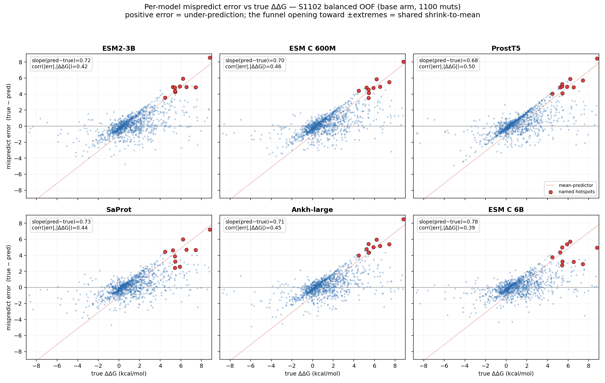

# S1102 cross-fold mispredicted-ΔΔG analysis — base vs aug vs FoldX-phase2

_Updated 2026-07-15 — noted that on ESM C 6B the FoldX **scalar** arm out-lifts the 12-term MLP
(§20); the FoldX-p2 column here uses the MLP arm for cross-PLM consistency. A1 grid still in flight._
_Updated 2026-07-15 — added the per-model error-vs-ΔΔG scatterplot matrix under §C
(`error_vs_ddg_matrix.png` / `plot_error_vs_ddg.py`)._
_Updated 2026-07-16 — added the frontier-metric (per-structure Spearman) re-score section
+ headline #6 (`experiments/rescore_perstructure/`): pooled ρ collapses ~½ to within-complex; FoldX-p2
lift is ~10× larger and significant on every PLM; MINT is the worst arm per-structure._
_Updated 2026-07-16 — added the leakage-controlled by-complex retrain section
(`experiments/retrain_split/`): leakage confirmed (overall Pearson 0.85→0.72), FoldX−base survives
(P≥0.98), FoldX **scalar** is the top arm and widens (+0.19–0.25 ρ) while MLP holds, MINT negative
softens. Caveats: by-complex still homology-leaky; ESM C 6B + mmseqs-60 clustered run pending._
_Updated 2026-07-16 (later) — added "Frontier context, comparability & roadmap": S1102 = classical-lineage
subset (not the DL frontier's full-SKEMPI); clustered-split anchor ~0.51 P / 0.48 S (ProtBFF); by-complex
still leaky; A1/B ≈ published ProtBFF; comparability verified vs RDE; open-runs status._
_Updated 2026-07-18 — generalization ladder COMPLETE (clustered mmseqs-60 + ESM C 6B): base collapses to
ρ 0.02–0.37 out-of-family, FoldX lift widens to +0.10–0.42 (Gate A confirmed), FoldX arms converge to
~0.44 regardless of PLM, best ≈0.48 = ProtBFF clustered-split anchor; scalar-vs-MLP now PLM-dependent; MINT
reconfirmed worst (0.087). Caveats: single-point full-SKEMPI FoldX 28% coverage; A1/C1 ran ankh3 not Ankh-v1._
_Updated 2026-07-18 (later) — noted the 07-20 queue reorder: multi-point is the landing
confirmatory pillar (98.7% FoldX coverage — the clean generalization test; early ankh MP-clustered base 0.07 →
+FoldX 0.27), esm3+saprot13b complete the ladder, ESM-C 6B MP on GPU; scalar>MLP sharpened to ESM-C-specific._

Companion to `S1102_FOLD0_OUTLIER.md`. That doc dissected the single worst fold on the
**paper/rng** split. This one asks the generalization: pool the **out-of-fold predictions over
all 10 folds** and ask whether fold 0's failure mode is *the* failure mode, or just the first one
is noticeable — and how the three 300 ep / patience 30 **balanced-splitter** arms (**base**, **aug**,
**FoldX-phase2** = decomposed-12-term MLP `add_scores`) differ on the mistakes.

**Data.** `scratch/results/embedding_sweep_balanced/<plm>{,_aug,_foldxmlp}/fold_*/…/test_predictions.tsv`
for the sub-6B sweep PLMs, plus **Ankh-large** (balanced base = `scratch/results/cv10_ankh_converge/`,
the fork-default/balanced-splitter run whose per-fold PCCs match `benchmarks_folds_300ep_balanced.csv`
to the digit — fold 0 = 0.719983; aug/FoldX from the sweep dir) and **ESM C 6B** from
`scratch/incoming_esmc6b_20260714/` (balanced base = `results/base/S1102/`, aug = `results/aug/S1102/`,
FoldX-phase2 = `data/S1102/foldx/cv10_esmc6b_balanced/foldx_mlp/`). Both were verified 110/110-aligned
to the balanced split in **every** fold. Joined to true ΔΔG + the 12 standardized FoldX terms in
`scratch/foldx_s1102/splits_balanced_foldxdec/fold_*/S1102_filtered_test.tsv`. **Six PLMs** carry a
complete base+aug+FoldX set on the balanced splitter — **ESM2-3B, ESM C 600M, ProstT5, SaProt,
Ankh-large, ESM C 6B** — so every consensus number below is a 6-PLM mean over the pooled 1100 OOF
mutations. Reproduce with `scripts_plots/analyze_hotspots.py`.

> **Fold-index caveat.** The balanced splitter is a *different partition* than the paper/rng
> seed-42 split the fold-0 doc analyzed, so "fold 0" is not the same 110 mutations in the two docs.
> Hotspots here are reported at the **mutation / complex level** (splitter-invariant, because the
> analysis is pooled OOF); the per-fold PCC table is balanced-specific.

---

## Headline

1. **Fold 0 is not special — every fold has its hotspots.** The 40 worst-predicted mutations are
   spread across **all 10 balanced folds** (fold 5 carries the most, 6; folds 0/8 carry 5 each) —
   every fold has ≥2. The fold-0 dip is one draw of a phenomenon present everywhere: a per-fold PCC
   that tracks how many extreme interface hotspots happened to land in that fold's test set.
2. **One shared blind spot, and scale barely dents it.** base/aug/FoldX consensus residuals
   correlate **0.95–0.98**; cross-PLM base residuals **0.79–0.90**. **ESM C 6B is the most
   decorrelated PLM (0.79–0.83 vs the others) but still shares the blind spot** — all six PLMs,
   under all three arms, shrink the *same* extreme mutations toward the mean.
3. **The add-ons are floor-raisers that scale absorbs.** Pooled OOF ΔPCC from FoldX-phase2 falls
   with PLM strength — **ESM2 +0.019, ESM C 600M +0.017, Ankh +0.017, ProstT5 +0.013, SaProt +0.011,
   ESM C 6B +0.004** — while **aug goes flat on the two strong workhorses (Ankh +0.001, ESM C 6B
   −0.001)**. The strongest models have already learned most of what the levers add, and FoldX
   out-levers aug on every PLM.
4. **The regime is broader than steric clash — it's mostly electrostatic/charge.** The worst-40 are
   *not* enriched in gain-of-bulk (10% vs 11% overall) or →Ala (25% vs 30%). The dominant miss is an
   **extreme-magnitude charge/polar substitution at the interface** (1MAH Trp→Arg, 2O3B Asp→Glu,
   1BRS Arg→Gln), and the only FoldX term that tracks the residual is **Electrostatics** (r=0.20
   global / 0.30 on the worst-100), while **VdW-clash ≈ 0** (0.07 / 0.14). This refines the fold-0
   doc's P1-steric emphasis: steric clash is one regime; charged-interface hotspots are the larger,
   more pervasive one across folds.
5. **FoldX-phase2's edge is concentrated exactly on the hotspots.** On the worst-25 by base error it
   beats base **76%** of the time (MAE 4.09→3.74) while **aug beats base only 48%** (aug *hurts* the
   very worst). But it's a floor-raiser, not an oracle: it still squashes the biggest steric clashes
   (1PPF L18W 2.6→2.8 vs true 7.4) and the biggest electrostatic ones (1MAH WA276R ≈1 vs true 8.8).
6. **Under the frontier metric (per-structure Spearman), FoldX is the top lever by a wide margin —
   and it *survives the leakage-controlled split*.** Re-scoring by within-complex ranking collapses pooled ρ
   0.72–0.81 → 0.31–0.59 (leverage) and shows FoldX-p2's per-structure lift is **+0.08–0.21 ρ, ~10× its
   pooled-PCC lift, significant on every PLM**. The **generalization ladder** (by-complex → **clustered
   mmseqs-60**, now complete incl. ESM C 6B) confirms it *generalizes and widens*: base collapses to
   ρ 0.02–0.37 out-of-family, FoldX's lift widens to **+0.10–0.42**, the FoldX arms converge to ~0.44
   regardless of PLM, and the best arm ≈ **0.48 = level with the ProtBFF clustered-split anchor**.
   (Scalar-vs-MLP is PLM-dependent at clustered — scalar for the strong PLMs, MLP for several mids.)

---

## Pooled OOF PCC (all 1100) — per PLM × arm

| PLM | base | aug | FoldX-p2 | Δ(FoldX−base) | Δ(aug−base) |
|---|---|---|---|---|---|
| ESM2-3B | 0.838 | 0.849 | 0.857 | **+0.019** | +0.011 |
| ESM C 600M | 0.841 | 0.841 | 0.858 | +0.017 | +0.000 |
| ProstT5 | 0.829 | 0.837 | 0.842 | +0.013 | +0.008 |
| SaProt | 0.856 | 0.861 | 0.867 | +0.011 | +0.005 |
| Ankh-large | 0.843 | 0.844 | 0.860 | +0.017 | **+0.001** |
| **ESM C 6B** | **0.886** | 0.885 | 0.890 | **+0.004** | **−0.001** |
| **6-PLM consensus pred** | **0.870** | **0.877** | **0.881** | +0.011 | +0.007 |

> **FoldX-p2 = the 12-term MLP arm for all six PLMs (cross-PLM consistency).** On ESM C 6B
> specifically the FoldX **scalar** arm is *higher* than the MLP — RESULTS §20 reports the 6B balanced
> lift as **+0.007 scalar vs +0.004 MLP** — so the +0.004 shown here is the MLP figure and slightly
> understates 6B's best FoldX. (Metric note: this table is **pooled OOF** PCC; §20's cross-fold-mean
> figures read ~0.881 base / 0.885 MLP for the 6B — same +0.004 Δ, different pooling.)

**ESM C 6B is the ceiling; Ankh and the 6B are the proof of mechanism.** The 6B is the strongest
base model by a wide margin (0.886) and one of two PLMs where **the add-ons nearly vanish** — aug
−0.001, FoldX +0.004. Ankh (the reported workhorse) is the other: **aug does essentially nothing on
it (+0.001)** yet **FoldX still adds +0.017**. So Δ(FoldX−base) trends with weakness while
Δ(aug−base) collapses on the strong models — FoldX out-levers aug on every PLM and is the only lever
that survives scale, the per-PLM confirmation of `FOLDX_SUMMARY.md` §18.2/§19.

---

## Per-fold PCC by arm (balanced splitter, 6-PLM mean)

| fold | base | aug | FoldX-p2 | n | note |
|---|---|---|---|---|---|
| **0** | **0.734** | 0.734 | **0.761** | 110 | weakest fold; FoldX +0.027 |
| **8** | **0.802** | 0.805 | **0.841** | 110 | 2nd-weakest; **FoldX +0.039** (biggest lift) |
| 9 | 0.817 | 0.822 | 0.823 | 110 | |
| 3 | 0.824 | 0.827 | 0.840 | 110 | |
| 7 | 0.833 | 0.835 | 0.842 | 110 | |
| 2 | 0.867 | 0.866 | 0.870 | 110 | FoldX flat |
| 6 | 0.878 | 0.884 | 0.881 | 110 | |
| 4 | 0.883 | 0.877 | 0.893 | 110 | |
| 1 | 0.892 | 0.904 | 0.907 | 110 | |
| 5 | 0.896 | 0.904 | **0.918** | 110 | |

**Floor-raiser pattern, confirmed on balanced folds.** FoldX's gain anti-correlates with baseline
strength: the two weakest folds (0, 8) get the two biggest lifts (+0.027, +0.039); strong folds
(2, 6) are flat. Note the **splitter flip** vs `FOLDX_SUMMARY.md` §18: on the *paper* split FoldX
*hurt* fold 0 (then the *strongest* paper fold); on the *balanced* split fold 0 is the *weakest* and
FoldX helps it — same rule ("help weak folds"), different fold membership.

---

## The worst points across all folds (grand mean |err| over the 18 model-arms)

| pdb | mut | fold | true ΔΔG | base | aug | FoldX-p2 | regime |
|---|---|---|---|---|---|---|---|
| **1MAH** | WA276R | 2 | **8.81** | 1.18 | 0.79 | 1.01 | enzyme-core aromatic→charge |
| **2PCC** | EA290A | 7 | 6.20 | 0.31 | 0.14 | 0.74 | charge loss (Ala), rim |
| 1PPF | LB18W | 0 | 7.44 | 2.60 | 2.46 | 2.79 | P1 gain-of-bulk clash |
| 1MAH | YA69N | 0 | 5.22 | 0.49 | 0.32 | 0.79 | enzyme aromatic loss |
| **2O3B** | DB75N | 3 | 5.90 | 1.29 | 1.06 | 1.35 | interface Asp→Asn |
| **2O3B** | DB75E | 9 | 5.44 | 0.93 | 0.93 | 1.00 | interface Asp→Glu |
| 1PPF | LB18Y | 0 | 6.54 | 1.92 | 1.90 | 2.44 | P1 gain-of-bulk clash |
| 2J0T | TB2R | 8 | 5.04 | 1.06 | 1.02 | 1.19 | charge swap |
| 1KTZ | SB28L | 0 | 4.48 | 0.44 | 0.20 | 1.33 | gain-of-bulk clash |
| 1JTG | EA85A | 8 | 4.06 | 0.22 | 0.02 | 0.49 | β-lactamase·BLIP charge loss |
| **1BRS** | RA81Q | 5 | 5.42 | 1.37 | 1.31 | 2.64 | barnase-barstar charge hotspot |
| 1JTG | EA79K | 8 | 4.23 | 0.20 | −0.02 | 1.62 | charge swap |
| 1R0R | AB10R | 1 | 5.45 | 1.58 | 1.78 | 2.20 | P1' charge |
| 2O3B | EB24A | 5 | 5.47 | 2.01 | 1.48 | 2.64 | charge loss (Ala) |

**Read:** the biggest single miss in the whole set is **1MAH WA276R (Trp→Arg, true 8.81, every arm
≈1)** — an aromatic-to-charged swap in the acetylcholinesterase·fasciculin core, not a P1 steric
clash, and **even ESM C 6B doesn't rescue it** (the 6-PLM base is 1.18, still off by 7.6).
The 2O3B (NuiA) Asp75/Glu24 cluster and the 1BRS/1JTG charge hotspots are all new relative to the
fold-0 doc and all electrostatic. **31 of the worst 40 are under-predicted** (models shrink), and
the worst-40 mean |true| is **4.64 vs 1.80** globally — the misses are the extreme tail, compressed
toward the mean.

---

## Problematic structures (systematically hard complexes, mean grand |err|, ≥4 muts)

| pdb | system | mean\|err\| | n | in fold-0 doc? |
|---|---|---|---|---|
| **2O3B** | NuiA nuclease · inhibitor | **3.05** | 7 | new |
| **1MAH** | acetylcholinesterase · fasciculin | 2.73 | 7 | partial (YA69N only) |
| **2PCC** | cytochrome c peroxidase · cytochrome c | 1.94 | 6 | new |
| 1CSE | subtilisin · eglin c | 1.78 | 6 | partial |
| 2WPT | colicin E9 DNase · Im9 | 1.51 | 11 | new |
| 1JTG / 2G2U | β-lactamase · BLIP | 1.38 / 1.08 | 27 / 24 | new |
| 1FCC | IgG-Fc · protein G | 1.37 | 7 | new |
| 2J0T | metalloproteinase · TIMP-1 | 1.35 | 16 | new |
| 1BRS | barnase · barstar | 1.29 | 20 | new |
| 1AK4 | cyclophilin · HIV-1 capsid | 1.27 | 15 | new |
| 2FTL | trypsin · BPTI | 1.25 | 18 | yes |
| 1KTZ | TGF-β · type-II receptor | 1.20 | 20 | yes |
| 1PPF / 1R0R | elastase/chymotrypsin · OMTKY3 | (top hotspots) | — | yes |

Two families dominate: **tight enzyme·/protease·inhibitor interfaces** (1PPF, 1R0R, 2FTL, 1CSE,
2O3B, 1MAH, 2J0T) and **high-electrostatic model interfaces** (1BRS barnase-barstar, 1JTG/2G2U
β-lactamase·BLIP, 2WPT colicin·Im9, 2PCC cytochrome complexes). Both are systems whose binding
energy is set by *cross-chain* contacts a monomer PLM embedding cannot see — and adding a 6B
backbone doesn't change which complexes are hard.

---

## Are the three arms — and the six PLMs — making the same errors?

| arm pair | consensus residual r |
|---|---|
| base vs aug | **0.978** |
| base vs FoldX-p2 | 0.959 |
| aug vs FoldX-p2 | 0.948 |

| cross-PLM (base arm) | r | | cross-PLM (base arm) | r |
|---|---|---|---|---|
| esm2 vs esmc600m | 0.894 | | esmc600m vs ankh | 0.895 |
| esm2 vs prostt5 | 0.875 | | esmc600m vs **esmc6b** | 0.826 |
| esm2 vs saprot | 0.862 | | prostt5 vs saprot | 0.854 |
| esm2 vs ankh | 0.873 | | prostt5 vs ankh | 0.876 |
| esm2 vs **esmc6b** | 0.817 | | prostt5 vs **esmc6b** | **0.785** |
| esmc600m vs prostt5 | 0.883 | | saprot vs ankh | 0.835 |
| esmc600m vs saprot | 0.867 | | saprot / ankh vs **esmc6b** | 0.834 / 0.834 |

**Aug barely moves the error structure** (base↔aug 0.978) — it rescales, it doesn't re-rank the
hard cases, which is why it fails on the worst tail. **FoldX-p2 is the most decorrelated arm** but
still 0.95–0.96 — it nudges a subset of electrostatic points, not a wholesale fix. Among PLMs, the
sub-6B backbones (incl. Ankh) sit at 0.83–0.90 with each other, and **ESM C 6B is the most
independent (0.79–0.83)** yet nowhere near orthogonal: scaling to 6B shaves the shared-error
correlation by ~0.05, not to zero. The blind spot is architectural, not a capacity problem a bigger
PLM erases.

---

## Does FoldX-phase2 actually fix the hotspots?

Paired on the hardest points (ranked by **base** |err|), 6-PLM MAE:

| set | base | aug | FoldX-p2 | FoldX<base | aug<base |
|---|---|---|---|---|---|
| worst-25 | 4.09 | 4.01 | **3.74** | **76%** | 48% |
| worst-50 | 3.46 | 3.40 | **3.12** | 76% | 48% |
| worst-100 | 2.85 | 2.78 | **2.58** | 71% | 51% |
| worst-200 | 2.27 | 2.20 | **2.07** | 67% | 55% |

FoldX-p2 is the better lever *exactly where it matters* — winning 70–80% of head-to-heads on the
tail — while **aug is a coin-flip on the worst-25 and slightly negative** on the very worst. This
is the per-mutation version of §19's "FoldX beats augmentation on the balanced splitter."

**Which physics term carries it?** Correlation of each standardized FoldX term with the base
consensus residual:

| term | global | worst-100 |
|---|---|---|
| **Interaction Energy (total)** | 0.232 | **0.293** |
| **Electrostatics** | 0.201 | **0.301** |
| Sidechain Hbond | 0.115 | 0.176 |
| VdW clash | 0.073 | 0.140 |
| VdW | 0.128 | 0.061 |
| (all others) | ≈0 | ≈0 |

The recoverable signal is the **total ΔΔG and its Electrostatics component**, not the clash terms —
the mechanistic reason FoldX-p2 helps the charged-interface hotspots (2O3B, 1BRS, 1JTG, 2PCC) more
than the pure steric ones. FoldX sees the cross-chain electrostatics the monomer embedding is blind
to, but its rigid backbone can't emit faithful clash magnitudes.

---

## Frontier-metric re-score: per-structure Spearman (`experiments/rescore_perstructure/`)

Everything above uses **pooled** PCC/error. The field's standard metric is **per-structure Spearman**
(rank mutations *within* each complex, average over complexes ≥10 muts — RDE/PPIformer convention;
our metric code validated to <1e-9 against `reference_ddg_splits/RDE-PPI`). Re-scoring the *same*
balanced OOF predictions under it changes two things sharply. ⚠ This is a **metric** change, not a
split change — predictions are still from the leaky per-mutation CV, so these are an **upper bound**.

1. **Pooled correlation was ~half leverage.** Overall Spearman 0.72–0.81 → per-structure ρ
   **0.31–0.59** (every arm drops 0.22–0.42) once the 3 mega-scanned complexes (48% of rows) stop
   carrying the score. The headline 0.85+ was mostly cross-complex spread, not within-complex ranking.
2. **FoldX-p2's value is ~10× larger here than pooled PCC showed.** Per-structure lift over the
   matched base PLM is **+0.08 to +0.21 ρ** (vs +0.004–0.019 on pooled PCC), **significant on every
   PLM** (paired cluster-bootstrap over the 24 complexes, all CIs exclude 0, P≥0.99). Every FoldX-p2
   arm outranks every non-FoldX arm. Pooled PCC was masking FoldX's real, design-relevant contribution.
3. **MINT is the *worst* arm per-structure** (0.31, significantly below base, Δ=−0.14 vs consensus
   base), with the largest overall→per-structure drop — its +0.035 *bulk* lift was cross-complex
   leverage; the per-structure context lift is **not significant** (+0.025, P=0.73).
4. **Retrieval survives the collapse:** AUROC (destab 0.84–0.89 / strong 0.85–0.91) and precision@50
   (~1.0) stay strong — the failure is magnitude / within-complex ranking, not flagging top
   destabilizers. (`SUMMARY.md`, `results.png`, `bootstrap_ci.py`.)

This *strengthens* the FoldX thesis and *sharpens* the MINT negative — both under the metric the
frontier actually reports. The generalization number needed the by-complex retrain — **now done
(next section)**.

---

## Leakage-controlled retrain: the full ladder — leaky → by-complex → clustered (mmseqs ≤60%)

The re-score above is a *metric* change on leaky predictions. This is the *split* change — retrain with
whole complexes (and whole homologous **families**) held out, evaluated with the same per-structure
harness. **The ladder is now complete for all cached PLMs incl. ESM C 6B** (2026-07-18;
`experiments/retrain_split/`, `scripts_plots/results_matrix_ps.csv`). Per-structure Spearman(T≥10):

| split | base ρ (range) | +FoldX ρ (range) | FoldX Δ-lift vs base |
|---|---|---|---|
| leaky (S1102) | 0.33–0.49 | 0.51–0.57 | +0.08 … +0.21 |
| by-complex (whole PDB out) | 0.28–0.35 (6B 0.45) | 0.44–0.55 | +0.15 … +0.25 |
| **clustered (mmseqs ≤60%, whole family out)** | **0.02–0.37** | **~0.44 ± 0.03** | **+0.10 … +0.42** |

1. **Base PLMs collapse as the split tightens; the leakage is now quantified end-to-end.** Clustered
   base ρ = **0.02–0.37** (ProstT5 **0.020**, Ankh3-large 0.107, MINT 0.087; ESM C 6B best base at
   **0.370**). Sequence-only base barely ranks mutations within an *unseen family* — the leakage-controlled
   generalization number, and it reproduces ProtBFF's homology-split collapse on MuLAN.
2. **FoldX generalizes, and its lift *widens monotonically* with strictness (Gate A CONFIRMED).**
   Δ vs base: leaky +0.08–0.21 → by-complex +0.15–0.25 → **clustered +0.10 to +0.42** (ProstT5
   0.02→0.44 = **+0.42**). This resolves the earlier by-complex ambiguity: FoldX doesn't just *hold*,
   it *widens* once homology is removed — because the base collapses while FoldX holds.
3. **The FoldX arms converge to ~0.44 ± 0.03 across all PLMs**, largely independent of the base — once
   FoldX is added, the PLM identity barely matters (ProstT5 base 0.02 + FoldX ≈ ESM C 6B base 0.37 +
   FoldX). The physics carries the cross-family generalization.
4. **Frontier-competitive on the leakage-controlled split — but do not quote this comparison.**
   Best clustered arm ≈ **0.47–0.48** (SaProt / Ankh3-xl + FoldX-MLP), against ProtBFF's
   clustered-split anchor (~0.48 Spearman). `experiments/BENCHMARK_MATRIX.md` retracts exactly
   this pairing: it is the one rung where the two methods' FoldX baselines do not match, and the
   figures here are also the 28%-coverage lineage. The comparable framing is the *lift* over each
   method's own FoldX, which `docs/RESULTS.md` §26 reports.
5. **Scalar-vs-MLP is PLM-dependent — *not* a blanket rule (revised).** At the clustered level the
   winner *flips by PLM*: **scalar clearly wins only for ESM C** (6B Δscalar **+0.090** vs Δmlp
   **+0.015**; 600M +0.193 vs +0.097); for weaker/mid PLMs (ProstT5, SaProt, ESM2, Ankh3) the MLP is
   ≈/> scalar. The sharp framing: *FoldX helps everyone under leakage-controlled splits; for the **strongest** base
   model the simple scalar already captures the physics and the 12-term MLP adds nothing, while
   mid-strength PLMs still benefit from the decomposition.* (Multi-point runs in flight test this
   off-single-point — early ankh MP-clustered signal: base 0.07 → +FoldX 0.27, same pattern.)
6. **ESM C 6B stays the best base at every rung** (leaky 0.49 → by-complex 0.45 → clustered 0.37) and
   takes the *smallest* FoldX lift (Δ +0.09 clustered) — scale buys base generalization, leaving least
   for FoldX, but even 6B base collapses to 0.37 out-of-family.
7. **MINT is the worst arm — reconfirmed under homology control.** Clustered `mint_base` = **0.087**
   (dead last). The by-complex "softening" (mid-pack there) does **not** survive; MINT generalizes worst.

**Read:** the completed ladder **upgrades the thesis** — base PLMs don't generalize across families
(clustered ρ ~0.15), FoldX is the lever that does (widening to +0.4, converging to ~0.44 regardless of
PLM), and MuLAN+FoldX reaches ~0.48 = frontier-comparable level. ⚠ Caveats: the **single-point** full-SKEMPI
+FoldX arm is at **28% FoldX coverage** (112/314 complexes) — provisional there — but the **multi-point**
full-SKEMPI FoldX is **98.7%** covered, so the multi-point generalization test (landing now) is the *clean* one;
and the A1/C1 "ankh" arms actually ran **ankh3_large**, not the MuLAN-paper Ankh-v1
(`experiments/ANKH_PROVENANCE_AUDIT.md`) — v1 reference arms are being rebuilt.
(`experiments/retrain_split/SUMMARY.md`, `SUMMARY_clustered.md`, `scripts_plots/results_matrix_ps.csv`.)

---

## Relative strengths / weaknesses (arm summary)

- **base (PLM only)** — strong on the bulk (0.83–0.89 per PLM; ESM C 6B best at 0.886) but hard-caps
  the extreme tail: it *can* emit large values yet systematically shrinks cross-chain hotspots to
  ~1–2 kcal/mol because their magnitude lives in the partner chain. Scaling to 6B raises the floor,
  not the tail.
- **aug** — a rescale that helps some mid-range folds but *cannot* touch the hotspots (base↔aug
  0.978) and **flatlines on the two strong workhorses (Ankh +0.001, ESM C 6B −0.001)**. Cheapest
  lever, smallest ceiling, first to vanish as the PLM strengthens.
- **FoldX-phase2 (12-term MLP)** — best arm on every PLM and the only one that re-ranks the hard
  tail, via Electrostatics/total-ΔΔG. Floor-raiser, not oracle: Δ shrinks from +0.019 (ESM2) to
  +0.004 (ESM C 6B) but stays positive everywhere; overshoots rigid-backbone clashes, undershoots
  cavity/enzyme-side losses.

---

## Projected generalization beyond SKEMPI

- **The blind spot is architectural, and now shown to be scale-resistant.** It is cross-chain
  interface energetics (chiefly electrostatics) that a *monomer* PLM embedding cannot encode. Adding
  the strongest available embedder (ESM C 6B) shifts aggregate PCC up but leaves the *same*
  complexes (1MAH, 2O3B, 1PPF, 1BRS) mispredicted and only mildly decorrelates the errors. Expect
  this on **any** PPI ΔΔG set whose signal lives in charged/interface hotspots.
- **Where it will bite hardest:** antibody–antigen affinity maturation and de novo binder design,
  dominated by long-range electrostatic complementarity and buried charge — the regime the worst-40
  here occupy. PLM-only ΔΔG will look strong on aggregate PCC yet miss the high-leverage design
  mutations, the way it "passes" S1102 at 0.87 while missing 1MAH WA276R by ~8 kcal/mol.
- **What generalizes as a fix:** a **complex-aware physics channel**, not a bigger PLM. Cross-PLM
  residuals stay 0.79–0.90 even at 6B, so scale won't decorrelate the errors; the orthogonal signal
  is cross-modality (physics vs. PLM). FoldX electrostatics is the cheap version and already
  recovers ~⅓ of the tail signal; faithful magnitudes on the steric/cavity subset need
  flexible-backbone physics (Rosetta flex-ddG) or FEP for the charge-changing outliers.
- **Practical read for the next model:** if ESM C 6B is runnable, run it — it's the base ceiling and the
  add-ons buy little on top of it. Below 6B, FoldX-phase2 (Electrostatics term) is the best
  single lever and it targets the pervasive charged-hotspot regime; encode the mutant side chain in
  the *partner pocket* (interface-aware, not monomer 3Di) to push further. The handful of pure
  steric clashes (1PPF P1) likely remain a single-structure ceiling for everyone.

---

## Alternatives to address the problematic structures

**Where the blind spot lives in the code.** `LightAttModel.forward` (`mulan/modules.py:193`) runs a
Siamese encoder over four *independently-embedded* sequences `[wt1, wt2, mut1, mut2]`, then combines
the two chains by a **global pooled product + abs-difference**:

```python
x_wt  = [enc(wt1)*enc(wt2), |enc(wt1) - enc(wt2)|]
x_mut = [enc(mut1)*enc(mut2), |enc(mut1) - enc(mut2)|]
output = x_mut - x_wt   # + zs (FoldX), struct_ctx, ... concatenated onto the head
```

Two structural facts fall out, and they *are* the diagnosis above: (i) **each chain is embedded by
the PLM alone** — chain A's embedding never saw chain B, so the cross-chain coulombic energy that
sets 1BRS/1MAH/2O3B/1JTG ΔΔG is simply absent from the input; (ii) the chains are merged by a
**pooled** product with **no residue-level cross-chain attention**, so even the two embeddings the
model *does* have are combined without knowing *which* interface residues pair — the pairwise
interface is gone before the regression head sees it. The existing side channels (`add_scores`/`zs_mlp`
= FoldX 12-term MLP, `struct_context` B1, `interface_bias` C3, `struct_gate` E1) bolt information back
on *after* this bottleneck; FoldX recovers ~⅓ of the electrostatic tail precisely because it is the
only signal that saw both chains, but as a pooled scalar on a lossy head it raises the floor without
re-ranking the tail.

Ordered by cost-to-signal. Original sequence was C1 → A2 → B2/A3 → B1; the MINT/A2 result (below)
**re-ranks it to C1 → A1 → B2 → A2/A3 → B1**: A2 showed that feeding more cross-chain signal into
the *current* pooled head does **not** fix the tail (MINT is the worst arm on the worst-40), so the
bottleneck is the head + MSE loss — meaning the cheap loss change (**C1**) and the head-architecture
change (**A1**) now lead, and the input-channel routes (A2/A3/B) are worth pursuing only paired with
a head that can use them. **B1 is demoted** to a confirm-only ablation.

> **⛔ Base-model note (2026-07-16).** The **A1** and **C1** grids as first built ran on **`ankh3_large`**
> (`config_{a1,c1}_ankh3_large.sh`, formerly mis-named `config_{a1,c1}_ankh.sh`), **not** the v1
> **Ankh-large** reference (tag `ankh`, `cv10_ankh_converge`) that every base/aug/FoldX number in this
> doc uses. Ankh3 was deprioritised (weak CV10); the reference must ride every experiment. Those grids
> were killed/dequeued; v1 reference arms are now configured (`config_{a1,c1}_ankh_large.sh`). Full
> provenance: `experiments/ANKH_PROVENANCE_AUDIT.md`. (The **base** "Ankh-large" rows below —
> `cv10_ankh_converge` — are genuinely v1 and unaffected.)

**A — attack the architectural root (give the model the cross-chain interface)**
- **A1. Interface cross-attention.** Replace the pooled `enc(1)*enc(2)` with a cross-attention block
  between chain-1 and chain-2 residues, masked to interface contact pairs. The interface mask is
  cheap to build from material already in the repo: the **110 bound two-chain complex PDBs** in
  `scratch/foldx_s1102/work/<PDB>/` (from the FoldX Stage-2 run) plus the validated role→chain map in
  `skempi_v2.csv`; and `structural_context/contacts.py` already builds a **chain-scoped** KD-tree
  (`build_kdtree(..., chain_id=…)`), so it just needs to query a chain-A residue against the
  **chain-B** tree rather than its own (today it returns single-structure burial, "self excluded" ≠
  chain-excluded). The heavy cost here is the model surgery, not the contacts.
- **A2. Complex-context embeddings.** Re-embed each chain *in the presence of its partner*, then
  feed the existing pipeline — a new embedding set, no model surgery, the cheapest on-thesis probe of
  the root-cause hypothesis and the "encode the mutant side chain in the partner pocket"
  recommendation made concrete. Two ways to source them:
  - **Naive:** concatenate the two chain sequences with a linker so the PLM's attention crosses the
    interface. Zero new dependencies but conflates the chains and is length-limited.
  - **Purpose-built — MINT (recommended).** [MINT](https://github.com/VarunUllanat/mint)
    (*Multimeric INteraction Transformer*, Ullanat/Jing/Sledzieski/Berger, Nat. Commun. 2026) is an
    **ESM-2-650M backbone with cross-chain attention**, pretrained on 96M STRING PPIs — a genuinely
    multi-chain embedder, weights on HF at `varunullanat2012/mint` (`mint.ckpt`, MIT). With
    `sep_chains=True` it emits each chain's embedding **computed in the context of its partner**,
    which is exactly the cross-chain signal the Siamese `enc(1)*enc(2)` bottleneck discards. It is
    directly on-benchmark: it ships a **SKEMPI v2 ΔΔG** downstream example
    (`downstream/GeneralPPI/SKEMPI_v2`) and the paper reports ~29–30% improvement on SKEMPI binding
    ΔΔG, best among sequence-only methods. *Integration caveat:* the `MINTWrapper` helper returns
    **pooled, sequence-level** per-chain vectors (`(N, 2×1280)`), but MuLAN's light-attention head
    needs **per-residue** embeddings for its `wt1/wt2/mut1/mut2` difference — since MINT is ESM-2-
    based, pull the per-token contextual representations from the underlying model instead of the
    pooled wrapper output. Note this also changes the semantics of the `mut − wt` term: `mut1/mut2`
    are now embedded *as a complex*, so the difference is no longer identically-partnered — the
    intended effect, and worth an ablation vs. the monomer-embedded arms above.

    **⚠ Cancellation check — RESOLVED (10-fold CV complete; full plan + results in
    `docs/history/PLAN_MINT_A2.md`).** The worry was the WT-3Di trap: does the `mut − wt` Siamese
    difference wash out the new partner context? Algebraically it should *not* — the head combines
    chains **bilinearly** (`enc(1)⊙enc(2)`, not an additive concat) and MINT makes the *partner*
    chain's embedding **mutation-dependent**, so the product factors as
    `(a_mut−a_wt)⊙b_mut + a_wt⊙(b_mut−b_wt)`, whose second term is a genuinely new signal (identically
    zero in the monomer pipeline, where `b_mut≡b_wt`). **The cancellation worry was correct to raise,
    disproved as the mechanism, and the arm still failed the tail — for a different reason.** Findings:
    - **Un-cancellation confirmed.** The pooled label cache had to be re-keyed per (complex, mutation)
      or it would have re-zeroed the partner term (the FoldX/3Di trap, round 3 — 100% of S1102 is
      single-chain). Partner-sensitivity probe: mean shift **0.0062**, localized to interface residues
      (2O3B 0.0084, 1BRS 0.0081) but **near-zero on buried 1MAH WA276R (0.0018)** — MINT's context is
      strongest on the charged/electrostatic tail, weakest on the buried-core miss.
    - **Necessary, not sufficient — now on the full 10-fold CV.** Pooled OOF PCC **0.856** vs the
      6-PLM consensus 0.870, and MINT is the **worst arm on the worst-40 tail (MAE 3.71 vs FoldX
      3.38)** — the tail it was built for. Both previously-pending named hotspots confirm it: 2O3B
      DB75E 5.44→0.20, 1BRS RA81Q 5.42→0.71 (as bad as monomer). It lifts *bulk* PCC on the weak fold
      (fold 0 +0.058) but does not de-shrink the extremes.
    - **Subset correlation — RESOLVED, and it went the *un*-hopeful way.** Restricting to the interface
      subset where the partner genuinely moves (median δ_partner **0.093, ~3× the global**),
      corr(δ_partner, improvement) is **≤ +0.05 (negligible)** and MINT's MAE is worse than the
      consensus on **every** subset. Reviving the partner term doesn't help *even on its home turf* —
      so the earlier −0.04 global correlation wasn't just dilution; the signal genuinely doesn't route
      through this head. Mechanism (`diagnose_shrinkage.py`): the revived term is ~14× smaller than the
      primary term, so the bottleneck is the **head + MSE loss** (extremes regressed to the mean), not
      embedding partner-blindness.
    - **Consequences for the ranking below:** this **demotes B1** (routing a small-magnitude vector
      through `ctx_proj` won't move a head dominated by the primary term) and **promotes C1
      (tail-reweighted loss) and A1 (residue-level cross-chain attention)** as the real levers.
    - **Attribution — RESOLVED (§8a monomer-MINT ablation, 10/10 folds).** Re-embedding each chain
      *alone* through MINT's own backbone (`gen_mint_emb.py --single-chain`) and running the same
      balanced 10CV gives **MINT-mono pooled OOF 0.821** (cross-fold 0.811±0.065) vs **MINT-complex
      0.856** (cross-fold 0.850±0.039). So **complex-context (both chains) is worth +0.035 pooled
      (+0.038 cross-fold) PCC** — a *genuine, positive* lift, not the "≈ monomer + small noise" the
      complex-vs-consensus read alone suggested. (This +0.035 is a *different* quantity from the tiny
      δ_partner shift above: the ablation re-contextualizes **both** chains — including the *mutated*
      one — so the bulk lift is dominated by contextualizing the mutated chain, while the specific
      partner-shift term stays ~7% of primary and tail-useless. That reconciles "context is real" with
      "the partner term washes out.") The 0.856-vs-0.870 consensus gap decomposes as: context **+0.035**
      (complex−mono) on top of a mono arm that itself sits **−0.050** below the 6-PLM consensus
      (backbone + single-model-vs-ensemble). The −0.014 deficit is therefore *not* a context failure —
      one 650M-backbone model can't match a 6-model ensemble, and context claws back most of that gap.
      **Context lands mostly in the bulk — but the tail is not inert:** worst-40 MAE *does* improve mono
      **4.02** → complex **3.71** (a 0.31 gain), it just doesn't clear base **3.63**, and the extremes
      stay catastrophically shrunk in every arm (shrinkage slope |true|≥4: mono 0.782, complex 0.861,
      base 0.829 — all ≪ 1). So the ablation **reinforces the head+MSE tail bottleneck** while showing
      the embedding is not a no-op for bulk — and that cross-chain signal *does* nudge the tail, mild
      support for pursuing **A1** (residue-level, in-head) paired with **C1**. *Caveat:* no single-model
      ESM2-**650M** base arm exists — the suite's `esm2` is ESM2-**3B** (cross-fold 0.833), so the
      mono−backbone term is confounded with model size and with ensembling and can only be read
      approximately.

    (**gLM2** — `tattabio/gLM2_650M` on HF — is a second genuine multi-protein embedder but is
    genomic-context oriented, off-domain for these binding complexes; **PPIformer** is multi-chain
    but an SE(3) *structure* model, so it belongs under B, not A2.)
- **A3. Interface-pair descriptor channel.** Build a per-mutation feature vector of the mutated
  residue's cross-chain contacts (partner identities, distances, charge complementarity) from the
  same bound complex PDBs + chain-scoped KD-tree as A1 (query the mutated residue against the
  **partner** chain; `contacts.py` returns monomer burial today, so this is a call-site change, not
  new infrastructure), and inject via the live `struct_context`/`zs` hook. Cheapest of the three —
  most of the data plumbing already exists — though weaker in ceiling than A1/A2.

**B — better physics channel (fix what FoldX squashes)**
- **B1. flex-ddG (Rosetta).** Flexible backbone recovers the steric-clash magnitudes (1PPF P1
  gain-of-bulk, FoldX ≈2.8 vs true 7.4) the rigid FoldX backbone flattens. Drop-in as an extra
  `add_scores` term; heaviest compute, narrowest (steric-subset) payoff.
- **B2. Enrich the FoldX channel with explicit long-range electrostatics.** Electrostatics is the
  *only* term that tracks the residual (r=0.30 on worst-100); add a dedicated coulombic / interface
  charge-complementarity feature beyond the 12 terms. Cheap, targets the dominant regime.

**C — stop the model shrinking the tail (near-free, orthogonal to A/B)**

The regression-to-the-mean this section targets is visible directly in the per-model error structure
(`plot_error_vs_ddg.py`, base arm, 1100 balanced OOF points):



*Each panel is one PLM (base arm); y = signed error (true − pred, + = under-prediction), x = true
ΔΔG; red = named hotspots; the dotted line is where a pure mean-predictor sits (error = true − mean).
Read: the error funnel opens toward both extremes and the large-ΔΔG tail rides **up the mean-predictor
line** — the models emit ≈the mean there. It is a **shared** blind spot: `slope(pred~true)` = 0.68–0.78
(all < 1) and `corr(|err|, |ΔΔG|)` = 0.39–0.50 in every panel. Scale barely dents it — ESM C 6B has the
highest slope (0.78, least shrinkage) and lowest |err|–|ΔΔG| coupling (0.39), yet its hotspots still sit
on the mean-predictor line top-right (1MAH WA276R still ~5 off). This funnel is the visual signature of
the head + MSE-loss bottleneck the C levers attack.*

- **C1. Tail-weighted loss** (weight ∝ |ΔΔG|, or focal-style). 31/40 worst are *under*-predicted
  (worst-40 mean |true| 4.64 vs 1.80 global) — regression-to-the-mean. One training-loop change tests
  whether the shrinkage is loss-driven or a capacity wall. Risk: can cost bulk PCC.
- **C2. Heteroscedastic / quantile head.** Flag the hotspots for design triage rather than fix their
  magnitude.

**D — ensembling is not a fix.** Cross-PLM residuals stay 0.79–0.90 even at 6B (§ above), so stacking
decorrelated PLMs cannot erase the *shared* blind spot; the orthogonal axis is cross-modality
(physics vs. PLM), which is what A/B supply.

---

## Frontier context, comparability & roadmap (as of 2026-07-16)

This analysis lives on **S1102** (1,102 single-point muts / ~110 binary complexes) — a *classical-lineage*
subset (mCSM-PPI2 / MuPIPR / iSEE / GeoPPI / MuLAN), **not** the modern DL frontier's benchmark. That
context reframes everything above; details + effort in `experiments/REVIEW_gaps_and_landscape.md` §2.8/§4a/§4b,
`docs/history/PLAN_FULL_SKEMPI.md`, and `../reference_ddg_splits/` (RDE-PPI, PPIformer,
PPIRef, plus a private frontier survey and saved papers, neither shipped).

- **What the frontier actually uses:** the **full curated SKEMPI v2** (~7,085 muts / ~345 complexes),
  **single AND multiple** mutations, homology-aware splits (RDE by-complex → PPIformer `iclr24`
  family-stratified → CD-HIT/CATH-superfamily), + **antibody-antigen / DMS OOD** sets. S1102 is
  single-point, no antibodies (they were filtered out), easier splits → comparable to the *classical*
  crowd, not the DL frontier.
- **Leakage-controlled-split anchor (Dec-2025 lit):** ProtBFF's best on **CD-HIT ≤60%** is **~0.51 Pearson / ~0.48
  Spearman** — *not* 0.85. And **by-complex is still homology-leaky** (USP-ddG: 88.7% of by-complex test
  muts are "easy", TM-score ≥0.6 to train). **The mmseqs-≤60% clustered run is now done (§ above):**
  MuLAN+FoldX's best clustered arm ≈ **0.47–0.48 ρ = level with the ProtBFF anchor** — frontier-
  competitive on the actually-leakage-controlled split.
- **A1/B are now published** — **ProtBFF ≈ our A1+B** (FoldX biophysical features scaling embeddings +
  cross-embedding attention + anti-symmetry). The defensible wedge for this work stays the **diagnostic**
  (head+MSE bottleneck; FoldX's ~10× larger per-structure lift; FoldX-scalar generalizes), not a new method.
- **Comparability verified (2026-07-16):** our `skempi_v2.csv` **matches RDE's exactly** (7,085 rows /
  345 PDBs / 348 `#Pdb` / 1,973 multi-mut; ddG = RT·ln(Kd_mut/Kd_wt), spot-checked). To be
  frontier-comparable the full-SKEMPI expansion must **reuse RDE's `load_skempi_entries`** (not a
  hand-rolled curation) and frame MuLAN as a **sequence-supervised** entry (peers: ESM-1v / MSA-T /
  Tranception / MINT; structure SOTA = ceiling). Multi-day FoldX is **gated** (only 211/345 PDBs on
  disk; antibody multi-chain mapping must be pre-validated) — `docs/history/PLAN_FULL_SKEMPI.md` §8b.

**Open runs / status (2026-07-18):** ✅ **clustered
mmseqs-60 retrain** + ✅ **ESM C 6B** DONE — generalization ladder complete (§ above). 🏃 **Multi-point**
(the confirmatory pillar) landing Sat: MP retrain on Mac (`#97/#98`, auto-scored `#104/#105`) + **ESM C
6B multi-point on GPU** — **and multi-point full-SKEMPI FoldX coverage is 98.7%** (vs 28% single-point),
so it's the *cleaner* generalization test. Early MP signal (ankh, partial): **MP-clustered base 0.07 → +FoldX
0.27**, same base-collapse/FoldX-rescue pattern. ⏳ **esm3 + saprot13b** ladder retrain (`#99–102`)
completes the `--ps` ladder for all cached PLMs. ⏳ **full-SKEMPI single-point** sweep
resuming (best-effort; §8b gate PASSED — RDE curation reproduced, 4,165 rows / 315 complexes). 🐞
**A1/C1** rebuilding on Ankh-**v1** (prior grids ran ankh3, `ANKH_PROVENANCE_AUDIT.md`); 💤 **MINT+FoldX**
scoped. Monitoring runs as background daemons (`queue_watch.py`, `mp_watchdog.sh`). Status matrix:
`scripts_plots/results_matrix.py --ps`.

---

## Verification

- Pooled truth = **1100** rows; **all 1100** aligned across **6 PLMs × 3 arms × 10 disjoint OOF
  folds** (no leakage — each mutation scored only in its held-out fold).
- Ankh base = `cv10_ankh_converge`: verified 1100/1100-aligned to `splits_balanced_foldxdec`
  (every fold) and its per-fold PCC matches `benchmarks_folds_300ep_balanced.csv` to the digit
  (fold 0 = 0.719983), confirming it is the canonical balanced Ankh-large base run.
- ESM C 6B balanced arms verified 110/110-aligned to `splits_balanced_foldxdec` per fold (vs 9/110
  overlap with the paper split — confirming `incoming_esmc6b_.../results/base` is the *balanced*
  splitter, and `.../results/paper/*` the paper one).
- Standout hotspots cross-checked against `scratch/skempi_v2.csv`: 1MAH WA276R (COR), 2PCC EA290A
  (RIM), 2O3B DB75E/DB75N (RIM) are real entries with the stated cleaned codes.
- Per-PLM / pooled PCCs reconcile with `benchmarks_folds_300ep_balanced.csv` and `FOLDX_SUMMARY.md`
  §19 (ESM C 6B base ≈0.881–0.886; FoldX-MLP +0.011–0.019 on sub-6B, flat aug on 6B).
- Scripts: `scripts_plots/analyze_hotspots.py` (main), `analyze2.py` (FoldX-term + complex names);
  machine-readable dump `hotspots_table.json`.
